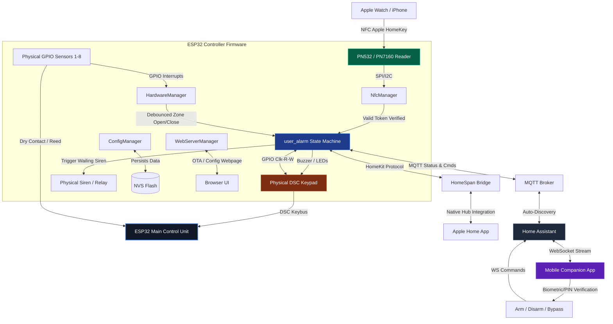

<div align="center">
  

  # ESP32 HomeKey-Enabled Alarm System
  ### *A professional-grade, multi-zone DIY security system with Apple HomeKey support*

  [](https://discord.com/invite/VWpZ5YyUcm)
  [](LICENSE)
  
  **A complete burglar alarm control panel featuring native Apple HomeKit & NFC-based Apple HomeKey authentication.**
  
  [Web Interface Documentation](https://rednblkx.github.io/HomeKey-ESP32/)

</div>

---

## 📌 Project Overview & Scope Pivot

Originally conceived as an NFC-based smart lock integration, this project has evolved into a **fully featured, DIY Alarm Control Panel** running on an ESP32. Instead of Apple HomeKey being the product itself, **HomeKey (NFC) now serves as the secure, high-speed credential system** to arm, disarm, and manage a complete household security grid.

The system mimics professional panels (like the DSC PowerSeries) by organizing physical and simulated sensors into security zones, enforcing standard Entry/Exit delay grace periods, sounding wailing sirens during breaches, and supporting physical/virtual DSC keypads. Tapping your iPhone or Apple Watch (via Apple HomeKey) instantly disarms the alarm and unlocks the entry point in a single, seamless, sub-300ms transaction.

---

## ✨ Features & What We Have Done

We have built a production-ready, split-architecture system consisting of **ESP32 Controller Firmware** and a high-fidelity **Companion Mobile App**.

### 1. Core Alarm Controller (State Machine)
We implemented a rigid security state machine running in the firmware (`user_alarm.cpp`) that enforces transition rules and safety measures:
*   **States**: `DISARMED`, `ARMING_AWAY`, `ARMING_HOME`, `ARMED_AWAY`, `ARMED_HOME`, `ENTRY_DELAY` (Pending), and `TRIGGERED` (Alarm wailing).
*   **Security Auditing**: Ready check prevents arming if any unbypassed zones are open.
*   **Entry/Exit Delays**: 15-second configurable count-down grace periods (aligned with DSC standard protocols) to enter/exit before arming or triggering.

### 2. Physical & Virtual DSC Keypad Integration
We fully integrated support for legacy hardware keypads (e.g., DSC PowerSeries PK5501/PC1555 keypads) using the DSC Keybus protocol:
*   **Real-time LED Mirroring**: The ESP32 controls the physical keypad's status LEDs (Ready, Armed, Bypass, Memory, Trouble) to reflect system states in real-time.
*   **Interactive Command Codes**:
    *   `*1`: **Zone Bypass Mode** (Bypasses active zones using keys 1-8).
    *   `*2`: **Trouble Diagnosis Mode** (LED 1 lights up for WiFi disconnection, LED 2 for NFC reader issues).
    *   `*3`: **Alarm Memory Mode** (Displays which zones triggered the alarm during the last armed period).
    *   `*4`: **Chime Control** (Toggles entry/exit door chimes).
    *   `*7`: **Zone Simulation Mode** (Permits testing and sensor toggles without physical hardware triggers).
    *   `*0` & `*9`: Quick arming in Away and Home modes, respectively.
*   **Hardware Protections**: Included anti-ghosting filtering to handle unpowered or unstable keypad connections (e.g., filtering false sequential `0` keypresses).
*   **Code Entry Validation**: Captures 4-digit user PINs to arm and disarm the system.

### 3. Multi-Zone Security Matrix
*   **8 Independent Zones**: Supports up to 8 sensor zones (doors, windows, motion detectors).
*   **Physical Inputs**: Configured via physical ESP32 GPIOs with internal pull-ups and active low/high triggers.
*   **Software Debouncing**: Integrated a 50ms software debounce filter to eliminate false triggers on noisy reed switches.
*   **Bypassing**: Zones can be bypassed individually either via the physical keypad or remotely via MQTT/Home Assistant.

### 4. Apple HomeKey (NFC) Credential System
*   **PN532 & PN7160 Driver Support**: High-performance NFC drivers supporting SPI/I2C.
*   **Apple Express Mode**: Authenticate and disarm the system using an iPhone or Apple Watch without waking the device or requiring biometric/passcode checks.
*   **Power Reserve Support**: Allows entry using Apple Watch/iPhone even when their main batteries are depleted.
*   **Immediate Feedback**: Taps generate instant audio-visual responses (double-beeps for successful disarm, error chirps on the keypad for failed taps).

### 5. Native Apple HomeKit Integration
*   Built on the **HomeSpan** framework, exposing the system directly to the iOS/macOS Apple Home app.
*   Presents itself as a native Security System Accessory, allowing native iOS control.

### 6. Smart Home & MQTT Broker Sync
*   Publishes alarm states (`disarmed`, `arming`, `armed_away`, `armed_home`, `pending`, `triggered`) and individual zone states (open, closed, bypassed) instantly.
*   **Home Assistant Autodiscovery**: Automatically exposes alarm control panels and binary sensors to Home Assistant without manual configuration.

### 7. Companion Mobile App (`vector-security-app`)
We designed and built a stunning, iOS-inspired hybrid app using React Native and Expo:
*   **Glassmorphic Aesthetic**: Premium dark mode UI featuring real-time blurred backgrounds (`expo-blur`), radial glowing status rings, micro-animations, and haptic feedback.
*   **Real-time WebSocket Sync**: Continuous communication with Home Assistant's WebSocket API to mirror and control states.
*   **Biometrics Integration**: Secure arming/disarming commands validated through FaceID or TouchID before transmission.
*   **Sensor Management**: Dedicated zone tab showcasing status (Open, Closed, Bypassed) of all 8 zones with manual bypass sliders.
*   **Secure Settings**: Persistent configurations secured locally via Android/iOS `expo-secure-store`.

---

## 📐 System Architecture

The following diagram illustrates how the hardware modules, firmware logic, MQTT broker, and mobile app interface together:



---

## 📂 Firmware Project Directory Structure

```
HomeKey-ESP32/
├── main/                       # Core ESP-IDF / C++ application source
│   ├── main.cpp                # System Entrypoint & manager startup
│   ├── user_alarm.cpp          # Core Alarm State Machine & Zone Matrix
│   ├── HardwareManager.cpp     # GPIO monitoring & zone debouncer
│   ├── NfcManager.cpp          # HomeKey NFC protocol handler
│   ├── HomeKitLock.cpp         # HomeSpan/HomeKit device bridge
│   ├── MqttManager.cpp         # Home Assistant MQTT integration
│   ├── WebServerManager.cpp    # Config Web UI, Websocket Server & OTA
│   ├── ConfigManager.cpp       # EEPROM/NVS parameters manager
│   ├── ReaderDataManager.cpp   # HomeKey credential verification
│   └── include/                # Header Declarations
│       ├── user_alarm.h        # Public alarm control interfaces
│       ├── config.hpp          # Persistent storage structs
│       └── defaults.h          # Hardcoded fallbacks & GPIO presets
├── components/                 # Git submodules & libraries
│   ├── DigitalDoorKey/         # Apple HomeKey cryptographic engine
│   ├── HomeSpan/               # HomeKit Accessory Protocol (HAP) engine
│   ├── dscKeybusInterface/     # DSC PowerSeries Keybus protocol driver
│   ├── pn532_cxx/ pn532_hal/   # PN532 NFC chip drivers (SPI/I2C)
│   ├── pn7160/                 # PN7160 NFC chip driver
│   └── msgpack-c/ loggable*/   # Serialization & logging helpers
├── data/                       # Svelte 5 Web interface build files
├── docs/                       # Project static pages (Hugo site source)
└── tools/arduino_uno_test/     # Standalone Arduino sketch to simulate zone sensors for bench testing
```

---

## 🛠️ Getting Started & Wiring

### 1. Prerequisites
*   **ESP32 Development Board** (ESP32-WROOM-32 or ESP32-S3).
*   **NFC Module**: PN532 (SPI recommended) or PN7160 (I2C).
*   **DSC Keypad**: PowerSeries PC1555 / PK5501 (optional, for physical interface).
*   **Sensors**: Magnetic door reed switches, PIR motion sensors, or limit switches.

### 2. Wiring Connections

#### NFC Module (PN532 SPI)
NFC GPIOs are **fully configurable from the Web UI** (or via a board preset, e.g. `CASmo-NFC`, `CASmo-NFC-MB-ETH`, `@lollokara's board`) — the table below is just an example wiring, not a fixed pinout:

| PN532 Pin | ESP32 GPIO | Description |
|-----------|------------|-------------|
| VCC       | 5V / 3.3V  | Power |
| GND       | GND        | Ground |
| SCK       | GPIO 14    | SPI Clock |
| MISO      | GPIO 12    | SPI Master In Slave Out |
| MOSI      | GPIO 13    | SPI Master Out Slave In |
| SS/CS     | GPIO 15    | SPI Chip Select |

> ⚠️ GPIO 13 and 14 above overlap with the example Zone 1 / Zone 3 pins in the table further down. If you're wiring both the NFC reader and physical zones, pick a preset/GPIO combo with no overlap (both the NFC pins and the zone pins can be reassigned from the Web UI).

#### DSC Keypad Keybus
Connection requires interfacing with the keypad's green (data out) and yellow (clock) lines. Use level-shifting transistors or resistor dividers if stepping down from the DSC 12V logic levels to ESP32 3.3V logic.
*   **DSC Clock (Yellow)** $\rightarrow$ **GPIO 21**
*   **DSC Read (Green - Keypad to Panel)** $\rightarrow$ **GPIO 18**
*   **DSC Write (Green - Panel to Keypad)** $\rightarrow$ **GPIO 19**

#### Zone Sensors (Zones 1-8)
Connect dry contacts between the designated GPIO and GND. The firmware configures internal pull-ups.
*   **Zone 1 (Entry/Exit door)**: GPIO 13
*   **Zone 2**: GPIO 17
*   **Zone 3**: GPIO 14
*   **Zone 4**: GPIO 25
*   **Zone 5**: GPIO 26
*   **Zone 6**: GPIO 27
*   **Zone 7**: GPIO 32
*   **Zone 8**: Configurable / Virtual

---

## 💻 Compilation & Flashing

This project uses the **ESP-IDF v5.1+** toolchain.

```bash
# 1. Clone repository and initialize submodules
git clone --recursive https://github.com/Defeeeee/HomeKey-ESP32.git
cd HomeKey-ESP32

# 2. Set targets and build
idf.py set-target esp32
idf.py build

# 3. Flash to ESP32 and monitor output
idf.py -p /dev/ttyUSB0 flash monitor
```

---

## 📱 Companion Mobile App (`vector-security-app`)

The companion mobile app (React Native + Expo) is maintained as a **separate project**, not part of this repository. It talks to the alarm exclusively through Home Assistant's WebSocket API (via MQTT autodiscovery), so any Home Assistant-compatible frontend or automation can be used in its place.

### How to Install and Run:
1.  Clone the `vector-security-app` repository to your machine.
2.  Install dependencies:
    ```bash
    npm install
    ```
3.  Start the Expo development server:
    ```bash
    npx expo start
    ```
4.  Open the iOS Simulator (`i`) or scan the QR code using your physical device.

---

## ⚖️ Disclaimer & License
*   This project is licensed under the **MIT License**.
*   **Disclaimer**: This project implements Apple HomeKey functionality through reverse engineering. Use at your own risk in security-critical environments. Not affiliated with Apple Inc. or DSC Tyco Security Products.
