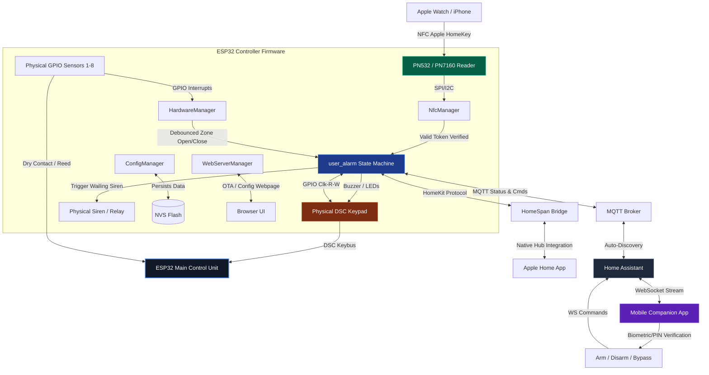

<div align="center">
  

  # ESP32 HomeKey-Enabled Alarm System
  ### *A professional-grade, multi-zone DIY security system with Apple HomeKey support*

  [](https://discord.com/invite/VWpZ5YyUcm)
  [](LICENSE)
  [](../../actions/workflows/esp32.yml)

  **A complete burglar alarm control panel featuring native Apple HomeKit & NFC-based Apple HomeKey authentication.**

  [Web Interface Documentation](https://rednblkx.github.io/HomeKey-ESP32/) · [Discord Community](https://discord.com/invite/VWpZ5YyUcm) · [Report a Bug](../../issues)

</div>

---

## 📌 Project Overview & Scope Pivot

Originally conceived as an NFC-based smart lock integration, this project has evolved into a **fully featured, DIY Alarm Control Panel** running on an ESP32. Instead of Apple HomeKey being the product itself, **HomeKey (NFC) now serves as the secure, high-speed credential system** to arm, disarm, and manage a complete household security grid.

The system mimics professional panels (like the DSC PowerSeries) by organizing physical and simulated sensors into security zones, enforcing standard Entry/Exit delay grace periods, sounding wailing sirens during breaches, and supporting physical/virtual DSC keypads. Tapping your iPhone or Apple Watch (via Apple HomeKey) instantly disarms the alarm and unlocks the entry point in a single, seamless, sub-300ms transaction.

> ⚠️ **Read the [Known Issues](#-known-issues) section before you rely on this in production** — a couple of items (NFC currently disabled by default, no PIN lockout) matter for a security device.

---

## ✨ Features

### 1. Core Alarm Controller (State Machine)
A dedicated security state machine running in firmware (`user_alarm.cpp`) enforces transition rules and safety measures:
*   **States**: `DISARMED`, `ARMING_AWAY`, `ARMING_HOME`, `ARMED_AWAY`, `ARMED_HOME`, `ENTRY_DELAY` (Pending), and `TRIGGERED` (Alarm wailing).
*   **Security Auditing**: A "Ready" check prevents arming while any unbypassed zone is open.
*   **Entry/Exit Delays**: Configurable grace periods (aligned with DSC standard protocols) to enter/exit before arming or triggering.
*   **Auto-Protect (no-motion auto-arm)**: Optionally arms automatically (Away or Home) after a configurable period of no motion/zone activity, with a single confirmation chirp.
*   **Persistent State**: The current alarm mode survives reboots/power loss (restored from NVS on boot).
*   **Alarm Memory**: Remembers which zones triggered the last alarm event for post-incident review.

### 2. Physical & Virtual DSC Keypad Integration
Full support for legacy hardware keypads (e.g., DSC PowerSeries PK5501/PC1555) over the DSC Keybus protocol, including real-time LED mirroring (Ready, Armed, Bypass, Memory, Trouble) and anti-ghosting protection for unpowered/unstable keypad wiring.

**Normal mode:**

| Input | Action |
|---|---|
| `0`-`9` (4 digits) | Enter the alarm PIN — arms Away if disarmed, disarms otherwise |
| `s` | Quick Arm **Home** (Stay), if currently disarmed |
| `a` | Quick Arm **Away**, if currently disarmed |
| `#` | Clear a partially-entered PIN, or quick-arm Away if the buffer is empty |
| `*` | Enter Command Mode |

**Command Mode** (after `*`):

| Code | Mode |
|---|---|
| `*1` | **Zone Bypass** — press 1-8 to toggle bypass on that zone |
| `*2` | **Trouble Diagnosis** — zone LEDs 1-4 flag Wi-Fi / NFC reader / MQTT / HomeKit pairing issues |
| `*3` | **Alarm Memory** — displays which zones triggered the last alarm |
| `*4` | **Chime Toggle** — entry/exit door chime on/off |
| `*6` | **Zone Simulation** — press 1-8 to toggle a virtual zone for bench testing without real sensors |
| `*7` | **Macro Mode** — press 1-9 to fire a numbered macro over MQTT (`home/alarm/keypad/macro`) for Home Assistant automations |
| `*8` | **Installer Menu** — prompts for a 4-digit installer code (see [Known Issues](#-known-issues)); once entered, `9` reboots the ESP32 and `2` toggles a Wi-Fi RSSI meter on the keypad |
| `*0` / `*9` | Quick arm Away / Home |

*   **Hardware Protections**: Anti-ghosting filtering for unpowered/unstable keypad connections, PIN idle timeout, and continuous keybus polling for reliable LED refresh.

### 3. Multi-Zone Security Matrix
*   **8 Independent Zones**: Doors, windows, motion detectors — physical GPIO or fully virtual/simulated.
*   **Software Debouncing**: 50ms debounce filter to eliminate false triggers from noisy reed switches.
*   **Per-Zone Bypass**: Individually via the physical keypad, the Web UI, or remotely via MQTT/Home Assistant.
*   **Per-Zone Disable**: Zones can be permanently excluded from Ready checks (e.g. a motion sensor zone ignored during entry delay/arming).

### 4. Apple HomeKey (NFC) Credential System
*   **PN532 & PN7160 Driver Support**: NFC drivers supporting SPI/I2C, with configurable GPIO presets from the Web UI.
*   **Apple Express Mode**: Authenticate and disarm using an iPhone or Apple Watch without waking the device or requiring biometrics/passcode.
*   **Power Reserve Support**: Entry still works with Apple Watch/iPhone even when their battery is depleted.
*   **Immediate Feedback**: Configurable GPIO/NeoPixel/buzzer feedback on success and failure.

> ℹ️ This subsystem is currently **disabled by default in `main.cpp`** pending hardware bring-up — see [Known Issues](#-known-issues).

### 5. Native Apple HomeKit Integration
Built on the [HomeSpan](https://github.com/HomeSpan/HomeSpan) framework, exposing the system as a native **Security System Accessory** directly to the iOS/macOS Apple Home app, linked to the HomeKey-backed lock service.

### 6. Smart Home & MQTT Broker Sync
*   Publishes alarm state (`disarmed`, `arming`, `armed_away`, `armed_home`, `pending`, `triggered`) and per-zone state (open/closed/bypassed) in real time, with LWT-based availability.
*   **Home Assistant Autodiscovery**: Automatically exposes the alarm control panel and binary sensors — no manual HA configuration required.
*   Optional TLS (with custom CA/client certs) for the MQTT connection.

### 7. Web Dashboard
A Svelte 5 single-page app served directly off the device (LittleFS), covering:
*   Live status, zone states, and a **Diagnostics** tab for at-a-glance system health.
*   Full configuration for Wi-Fi/Ethernet, MQTT, NFC GPIO presets, keypad/zone GPIOs, HomeKit setup code, and Web UI credentials.
*   OTA firmware upload, HTTPS certificate upload, and a Wi-Fi-based captive portal for first-time setup / recovery.
*   Optional HTTP Basic Auth to protect the dashboard.

### 8. Flexible Networking
*   Wi-Fi (DHCP, mDNS as `esp32-alarm.local`) with automatic captive-portal fallback (and auto-restart after repeated consecutive disconnects).
*   Optional Ethernet (SPI or RMII) with board presets, with automatic GPIO-conflict detection against the configured NFC pins.

### 9. Companion Mobile App (`vector-security-app`)
A separate React Native + Expo project providing a glassmorphic, iOS-inspired control surface:
*   Real-time WebSocket sync with Home Assistant.
*   FaceID/TouchID-gated arm/disarm actions.
*   Per-zone status and bypass sliders, with secured local settings storage.

---

## 🖥️ Supported Hardware

| Component | Options |
|---|---|
| **MCU target** | ESP32, ESP32-S3, ESP32-C3, ESP32-C6 (all built and tested in CI) |
| **NFC reader** | PN532 (SPI, recommended) or PN7160 (I2C) |
| **Physical keypad** | DSC PowerSeries PC1555 / PK5501 (optional) |
| **Zone sensors** | Magnetic reed switches, PIR motion detectors, dry-contact limit switches |
| **Network** | Wi-Fi, or Ethernet via SPI/RMII PHY |

---

## 📐 System Architecture



---

## 📂 Firmware Project Directory Structure

```
HomeKey-ESP32/
├── main/                       # Core ESP-IDF / C++ application source
│   ├── main.cpp                # System Entrypoint & manager startup
│   ├── user_alarm.cpp          # Core Alarm State Machine & Zone Matrix
│   ├── HardwareManager.cpp     # GPIO monitoring & zone debouncer
│   ├── NfcManager.cpp          # HomeKey NFC protocol handler
│   ├── HomeKitLock.cpp         # HomeSpan/HomeKit device bridge
│   ├── MqttManager.cpp         # Home Assistant MQTT integration
│   ├── WebServerManager.cpp    # Config Web UI, Websocket Server & OTA
│   ├── ConfigManager.cpp       # NVS-backed configuration manager
│   ├── ReaderDataManager.cpp   # HomeKey credential verification
│   └── include/                # Header Declarations
│       ├── user_alarm.h        # Public alarm control interfaces
│       ├── config.hpp          # Persistent storage structs
│       └── defaults.h          # Hardcoded fallbacks & GPIO presets
├── components/                 # Git submodules & libraries
│   ├── DigitalDoorKey/         # Apple HomeKey cryptographic engine
│   ├── HomeSpan/                # HomeKit Accessory Protocol (HAP) engine
│   ├── dscKeybusInterface/      # DSC PowerSeries Keybus protocol driver
│   ├── pn532_cxx/ pn532_hal/    # PN532 NFC chip drivers (SPI/I2C)
│   ├── pn7160/                  # PN7160 NFC chip driver
│   └── msgpack-c/ loggable*/    # Serialization & logging helpers
├── data/                        # Svelte 5 Web interface source & build
├── docs/                        # Project static pages (Hugo site source)
└── tools/arduino_uno_test/      # Standalone Arduino sketch to simulate zone sensors on the bench
```

---

## 🛠️ Getting Started & Wiring

### 1. Prerequisites
*   **ESP32 Development Board** (ESP32-WROOM-32, ESP32-S3, ESP32-C3, or ESP32-C6).
*   **NFC Module**: PN532 (SPI recommended) or PN7160 (I2C).
*   **DSC Keypad**: PowerSeries PC1555 / PK5501 (optional, for physical interface).
*   **Sensors**: Magnetic door reed switches, PIR motion sensors, or limit switches.

### 2. Wiring Connections

#### NFC Module (PN532 SPI)
NFC GPIOs are **fully configurable from the Web UI** (or via a board preset, e.g. `CASmo-NFC`, `CASmo-NFC-MB-ETH`, `@lollokara's board`) — the table below is just an example wiring, not a fixed pinout:

| PN532 Pin | ESP32 GPIO | Description |
|-----------|------------|-------------|
| VCC       | 5V / 3.3V  | Power |
| GND       | GND        | Ground |
| SCK       | GPIO 14    | SPI Clock |
| MISO      | GPIO 12    | SPI Master In Slave Out |
| MOSI      | GPIO 13    | SPI Master Out Slave In |
| SS/CS     | GPIO 15    | SPI Chip Select |

> ⚠️ GPIO 13 and 14 above overlap with the example Zone 1 / Zone 3 pins in the table further down. If you're wiring both the NFC reader and physical zones, pick a preset/GPIO combo with no overlap (both the NFC pins and the zone pins can be reassigned from the Web UI).

#### DSC Keypad Keybus
Connection requires interfacing with the keypad's green (data out) and yellow (clock) lines. Use level-shifting transistors or resistor dividers if stepping down from the DSC 12V logic levels to ESP32 3.3V logic.
*   **DSC Clock (Yellow)** → **GPIO 21**
*   **DSC Read (Green - Keypad to Panel)** → **GPIO 18**
*   **DSC Write (Green - Panel to Keypad)** → **GPIO 19**

#### Zone Sensors (Zones 1-8)
Connect dry contacts between the designated GPIO and GND. The firmware configures internal pull-ups (all zone GPIOs are reassignable from the Web UI).
*   **Zone 1 (Entry/Exit door)**: GPIO 13
*   **Zone 2**: GPIO 17
*   **Zone 3**: GPIO 14
*   **Zone 4**: GPIO 25
*   **Zone 5**: GPIO 26
*   **Zone 6**: GPIO 27
*   **Zone 7**: GPIO 32
*   **Zone 8**: Configurable / Virtual

### 3. First Boot & Configuration
On first boot (or after a Wi-Fi failure), the device starts a captive-portal access point (`HomeKey-ESP32`). Connect to it and use the Web UI to set your Wi-Fi/Ethernet credentials, HomeKit setup code, MQTT broker, NFC GPIO preset, keypad/zone GPIOs, and the alarm PIN — everything is persisted to NVS, no recompilation required.

---

## 💻 Compilation & Flashing

This project uses the **ESP-IDF v5.3+** toolchain and builds the Svelte web UI into a LittleFS image bundled with the firmware.

```bash
# 1. Clone repository and initialize submodules
git clone --recursive https://github.com/Defeeeee/HomeKey-ESP32.git
cd HomeKey-ESP32

# 2. Build the Web UI (LittleFS image) — see data/README or CONTRIBUTING.md for details
cd data && bun install && bun run build && cd ..

# 3. Set target and build the firmware — one of: esp32, esp32c3, esp32c6, esp32s3
idf.py set-target esp32
idf.py build

# 4. Flash to the ESP32 and monitor output
idf.py -p /dev/ttyUSB0 flash monitor
```

Every push to `main`/`dev` is built for all four targets by CI (`.github/workflows/esp32.yml`), which also publishes ready-to-flash firmware binaries to the [`dev` pre-release](../../releases/tag/dev).

---

## 📱 Companion Mobile App (`vector-security-app`)

The companion mobile app (React Native + Expo) is maintained as a **separate project**, not part of this repository. It talks to the alarm exclusively through Home Assistant's WebSocket API (via MQTT autodiscovery), so any Home Assistant-compatible frontend or automation can be used in its place.

### How to Install and Run:
1.  Clone the `vector-security-app` repository to your machine.
2.  Install dependencies:
    ```bash
    npm install
    ```
3.  Start the Expo development server:
    ```bash
    npx expo start
    ```
4.  Open the iOS Simulator (`i`) or scan the QR code using your physical device.

---

## ⚠️ Known Issues

This is an actively-developed DIY project — please read this list before relying on it as your only security system.

*   **NFC/HomeKey is currently disabled by default.** In `main.cpp`, NFC reader initialization is commented out pending hardware bring-up, so out-of-the-box builds will **not** unlock/disarm via Apple HomeKey until this is re-enabled and rebuilt. As a side effect, the keypad's `*2` Trouble Diagnosis mode will always show the NFC zone LED as "trouble" while this is the case.
*   **Fixed installer keypad code.** The `*8` installer menu (reboot / RSSI meter) uses a hardcoded 4-digit code baked into firmware, identical on every install, and not changeable from the Web UI. Physical access to the keypad is enough to trigger a remote reboot.
*   **No PIN lockout on the physical keypad.** The 4-digit alarm PIN can be retried indefinitely with no delay or lockout after repeated failures — brute-forcing it is only limited by how fast someone can press buttons.
*   **Web dashboard auth isn't constant-time.** The Basic Auth check in `WebServerManager` compares credentials with a standard string comparison, which is a (low-severity, LAN-only) timing side-channel.
*   **No automated tests for the alarm state machine.** `user_alarm.cpp` is validated manually against real DSC hardware; there's no host-side unit test suite covering state transitions.
*   Earlier revisions of this repository shipped with a developer's personal Wi-Fi SSID/password hardcoded in `main.cpp` for bench testing. It has been removed — if you built from an older commit, treat that Wi-Fi password as compromised and rotate it.

Found something else? Please [open an issue](../../issues).

---

## ⚖️ Disclaimer & License
*   This project is licensed under the **MIT License**.
*   **Disclaimer**: This project implements Apple HomeKey functionality through reverse engineering. Use at your own risk in security-critical environments. Not affiliated with Apple Inc. or DSC Tyco Security Products.
